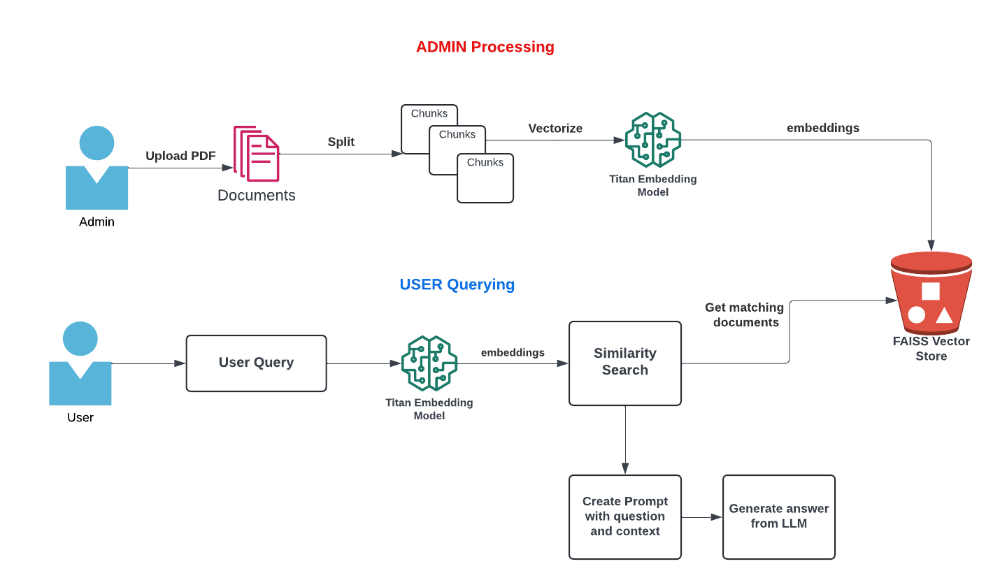

# PDF Reader with Vector Store and Conversational AI

This project consists of two main components: an Admin application and a User application. The Admin app is used for uploading and processing PDF documents to create a vector store, while the User app allows users to interact with the processed documents using a conversational AI interface.

## Project Structure

project/ <br>
├── Admin/<br>
│ ├── admin.py<br>
│ ├── requirements.txt<br>
│ └── Dockerfile<br>
├── User/<br>
│ ├── app.py<br>
│ ├── requirements.txt<br>
│ └── Dockerfile<br>
└── README.md

## Architecture



## Admin Application

The Admin application is responsible for uploading PDF documents, processing them into chunks, creating vector stores using FAISS, and uploading these vector stores to an S3 bucket.

### Dependencies

The required Python packages for the Admin application are listed in the `requirements.txt` file:

streamlit<br>
pypdf<br>
langchain<br>
faiss-cpu<br>
boto3<br>
langchain_community<br>


### Dockerfile

The Dockerfile for the Admin application:

```Dockerfile
FROM python:3.11
EXPOSE 8083
WORKDIR /app
COPY requirements.txt ./
RUN pip install -r requirements.txt
COPY . ./
ENTRYPOINT [ "streamlit", "run", "admin.py", "--server.port=8083", "--server.address=0.0.0.0" ]
```
### Running the Admin Application
Build and run the Docker image for the Admin application with the following commands:
docker build -t pdf-reader-admin ./Admin
docker run -e BUCKET_NAME=your-bucket-name -v ~/.aws:/root/.aws -p 8083:8083 -it pdf-reader-admin

## User Application
The User application allows users to interact with the PDF documents processed by the Admin app. Users can ask questions and get responses based on the contents of the PDFs.

### Dependencies
The required Python packages for the User application are listed in the requirements.txt file:

boto3<br>
streamlit<br>
langchain_community<br>
Dockerfile<br>

The Dockerfile for the User application:<br>

```Dockerfile (User)
FROM python:3.11
EXPOSE 8084
WORKDIR /app
COPY requirements.txt ./
RUN pip install -r requirements.txt
COPY . ./
ENTRYPOINT [ "streamlit", "run", "app.py", "--server.port=8084", "--server.address=0.0.0.0" ]
```

### Running the User Application
Build and run the Docker image for the User application with the following commands:

docker build -t pdf-reader-client ./User<br>
docker run -e BUCKET_NAME=your-bucket-name -v ~/.aws:/root/.aws -p 8084:8084 -it pdf-reader-client<br>

### Environment Variables
Both applications require the following environment variable:

BUCKET_NAME: The name of the S3 bucket where the vector store files will be uploaded and downloaded.<br>

## Uploading PDFs
To upload PDFs, navigate to the Admin application at http://localhost:8083/. Follow the instructions to upload and process the PDFs. The processed data will be stored in the specified S3 bucket.

## Conversational AI
To interact with the processed PDFs, navigate to the User application at http://localhost:8084/. You can ask questions about the PDFs, and the application will provide responses based on the document content.

### Notes
Ensure your AWS credentials are correctly configured in ~/.aws for both applications to access S3.
Adjust the paths in the docker run commands according to your local environment.

### License
This project is licensed under the MIT License. See the LICENSE file for more details.
